<!-- TOC -->
  * [第1步：了解问题并确定设计范围](#第1步了解问题并确定设计范围)
  * [第2步：提出高层次的设计方案并获得认同](#第2步提出高层次的设计方案并获得认同)
    * [轮询](#轮询)
    * [长轮询](#长轮询)
    * [WebSocket](#websocket)
    * [高层次设计](#高层次设计)
    * [可扩展性](#可扩展性)
    * [储存](#储存)
    * [数据模型](#数据模型)
  * [第3步：深入设计](#第3步深入设计)
    * [服务发现](#服务发现)
    * [消息流](#消息流)
      * [1对1聊天](#1对1聊天)
      * [多个设备间的信息同步](#多个设备间的信息同步)
      * [群组聊天流程](#群组聊天流程)
    * [在线状态](#在线状态)
      * [用户登入](#用户登入)
      * [用户登出](#用户登出)
      * [用户断开连接](#用户断开连接)
      * [在线状态输出](#在线状态输出)
  * [第4步：总结](#第4步总结)
  * [参考资料](#参考资料)
<!-- TOC -->

# 设计一个聊天系统

在本章中，我们将探讨聊天系统的设计，几乎每个人都使用聊天应用程序。 图 12-1 显示了市场上一些最流行的应用程序。

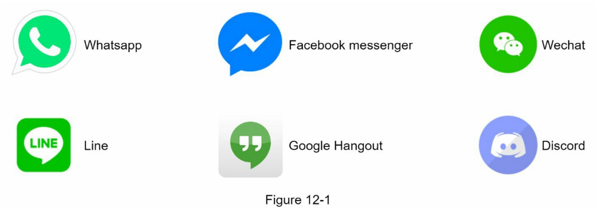

聊天应用程序对不同的人执行不同的功能。敲定确切的要求是极其重要的。例如，当面试官想到一对一的聊天时，你不希望设计一个专注于群组聊天的系统。探索功能要求是很重要的。

## 第1步：了解问题并确定设计范围

就要设计的聊天应用类型达成一致至关重要。市场上有Facebook Messenger、微信和WhatsApp等一对一聊天应用，Slack等专注于群聊的办公聊天应用，Discord等专注于大型群聊和低语音聊天延迟的游戏聊天应用。

第一组需要弄清楚的问题是应该明确面试官要求设计一个聊天系统时她的想法到底是什么。至少要弄清楚你是应该专注于一对一的聊天还是群组聊天应用。

你可以问的一些问题如下：

候选人：我们要设计什么样的聊天应用？ 1对1还是群聊？
面试官：应该支持1对1和群聊。

候选人：这是一个手机APP？还是一个web APP？或者两者都是？

面试官：都是。

候选人：这个应用程序的规模是多少？是创业公司的应用还是大规模的？

面试官：它应该支持5000万日活跃用户（DAU）。

候选人：对于小组聊天，小组成员的限制是什么？

面试官：最多100人

候选人：对于聊天应用程序来说，哪些功能是重要的？它能支持附件吗？

面试官：1对1聊天，群聊，在线状态。系统只支持文本信息。

候选人：信息大小有限制吗？

面试官：是的，文本长度应少于100,000字符。

候选人：是否需要端对端加密？

面试官：暂时不需要，但如果时间允许，我们会讨论这个问题。

候选人：我们应将聊天记录保存多长时间？

面试官：永久。

在这一章中，我们着重于设计一个类似于Facebook messenger的聊天应用，重点是以下功能：

- 一对一的聊天，消息传递延迟低
- 小组聊天（最多100人）。
- 在线状态
- 支持多个设备，同一账户可以同时登录多个账户。
- 推送通知

就设计规模达成一致也很重要，我们将设计一个支持 5000 万 DAU 的系统。

## 第2步：提出高层次的设计方案并获得认同

为了开发一个高质量的设计，我们应该对客户和服务器的通信方式有一个基本的了解。在一个聊天系统中，客户端可以是移动应用程序或Web应用程序。客户端之间并不直接交流。相反，每个客户端都连接到一个聊天服务，它支持上面提到的所有功能。让我们专注于基本操作。聊天服务必须支持以下功能：

- 接收来自其他客户端的信息。
- 为每条信息找到合适的收件人，并将信息转达给收件人。
- 如果一个收件人不在线，就在服务器上保留该收件人的信息，直到她在线。

图 12-2 显示了客户端（发送方和接收方）与聊天之间的关系服务。

当客户打算开始聊天时，它使用一个或多个网络协议连接聊天服务。对于一个聊天服务，网络协议的选择很重要。让我们与面试官讨论一下这个问题。

对于大多数客户端/服务器应用程序，请求由客户端发起。 对于聊天应用程序的发送方也是如此。

在图 12-2 中，当发送方通过聊天服务向接收方发送消息时，它使用久经考验的 HTTP 协议，这是最常见的 Web 协议。 在此场景中，客户端打开与聊天服务的 HTTP 连接并发送消息，通知服务将消息发送给接收者。 keep-alive 对此很有效，因为 keep-alive 标头允许客户端与聊天服务保持持久连接。 它还减少了 TCP 握手的次数。 HTTP 在发送端是一个不错的选择，许多流行的聊天应用程序（例如 Facebook [1]）最初使用 HTTP 来发送消息。

然而，接收方的情况就比较复杂了。由于HTTP是由客户发起的，因此从服务器发送消息并非易事。多年来，许多技术被用来模拟服务器发起的连接：轮询（Polling）、长轮询（, long polling）和 WebSocket。这些都是在系统设计面试中广泛使用的重要技术，所以让我们逐一研究。

### 轮询

  如图12-3所示，轮询是一种技术，客户端定期询问服务器是否有消息可用。根据轮询的频率，轮询的成本可能很高。它可能会消耗宝贵的服务器资源来回答一个大部分时间都没有答案的问题。

  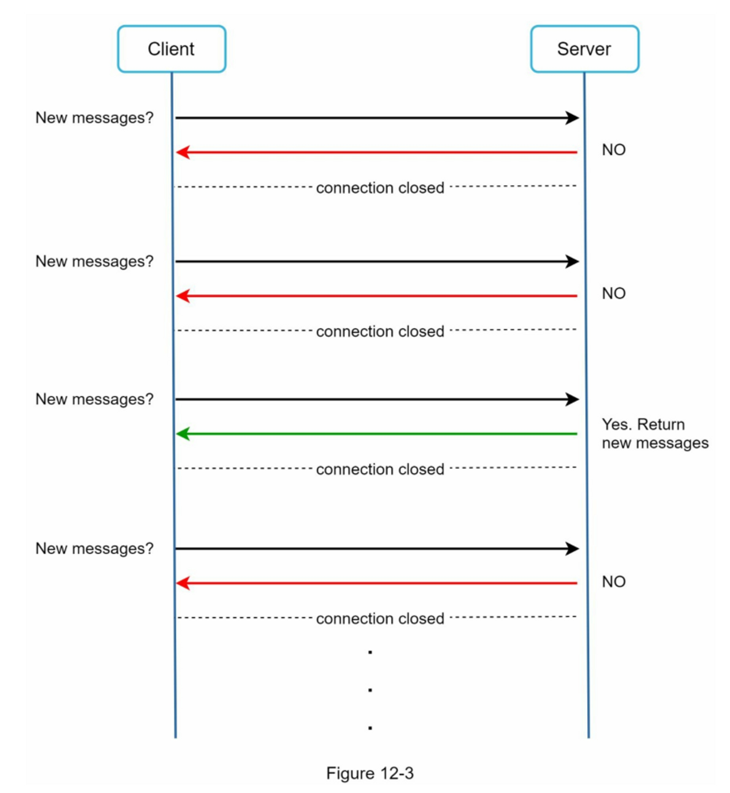

### 长轮询

因为轮询可能是低效的，接下来的是长轮询（图12-4）。

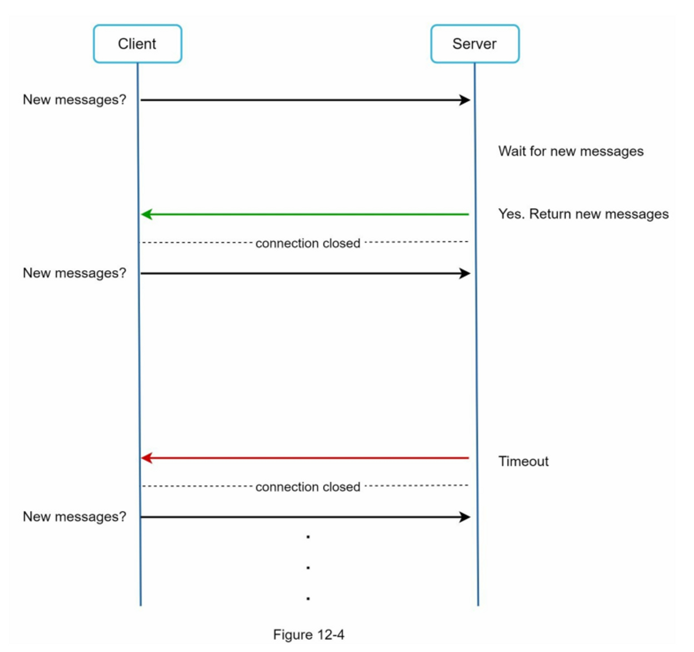

在长轮询中，客户端保持连接打开，直到实际有新消息可用或达到超时阈值。一旦客户端收到新消息，它会立即向服务器发送另一个请求，重新启动进程。

长轮询有一些缺点：

- 发送方和接收方可能不会连接到同一个聊天服务器。基于HTTP的服务器通常是无状态的。如果使用轮回技术进行负载平衡，接收信息的服务器可能没有与接收信息的客户端建立长期轮回连接。
- 服务器没有很好的方法来判断一个客户是否断开了连接。
- 它的**效率很低**。如果一个用户不怎么聊天，长时间的轮询仍然会在超时后进行周期性的连接。
### WebSocket

WebSocket是从服务器向客户端发送异步更新的最常见解决方案。

图12-5显示了它的工作原理。

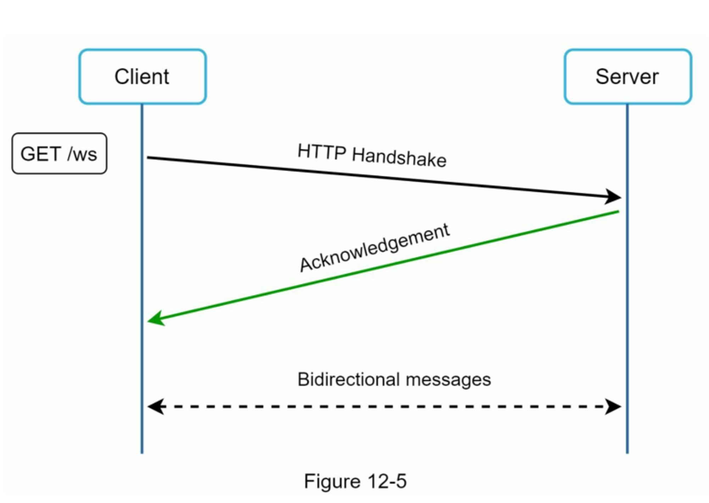

WebSocket连接是由客户端发起的。它是双向且持久的。它以HTTP连接的形式开始，并可通过一些定义明确的握手方式 "升级 "为WebSocket连接。通过这种持久的连接，服务器可以向客户端发送更新。即使有防火墙，WebSocket连接通常也能工作。这是因为它们使用80或443端口，这些端口也被HTTP/HTTPS连接所使用。

前面我们说过，在发送方使用HTTP是一个很好的协议，但由于WebSocket是双向的，没有充分的技术理由不把它也用于发送。

图12-6显示了WebSockets（ws）在发送方和接收方的使用情况。

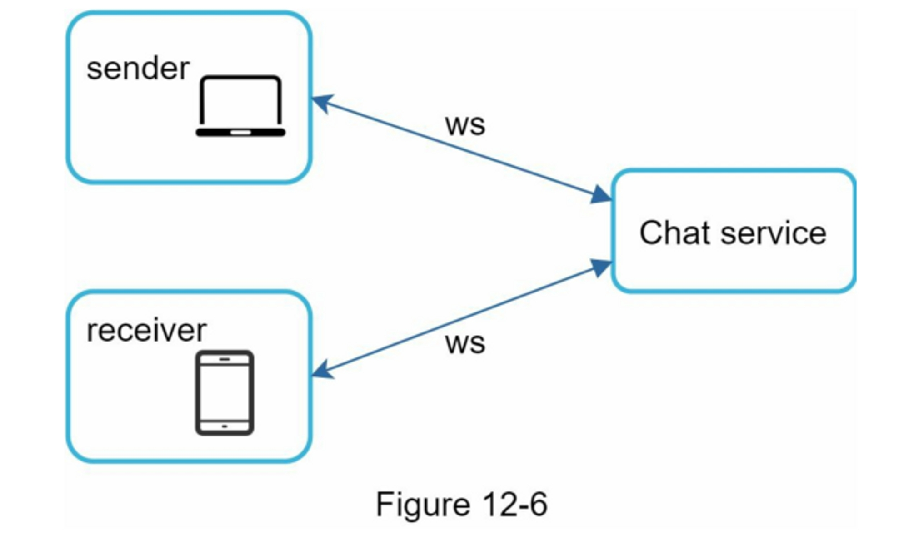

通过使用WebSocket进行发送和接收，它简化了设计，并使客户端和服务器上的实现更加直接。由于WebSocket连接是持久的，因此有效的连接管理在服务器端至关重要。

### 高层次设计

刚才我们提到，选择WebSocket作为客户端和服务器之间的主要通信协议，是因为它的双向通信，需要注意的是，其他一切都不一定是WebSocket。事实上，聊天应用程序的大多数功能（注册、登录、用户资料等）都可以使用HTTP上的传统请求/响应方法。

让我们深入了解一下，看看系统的高级组件。

如图12-7所示，聊天系统被分成三大类：无状态服务、有状态服务和第三方集成。

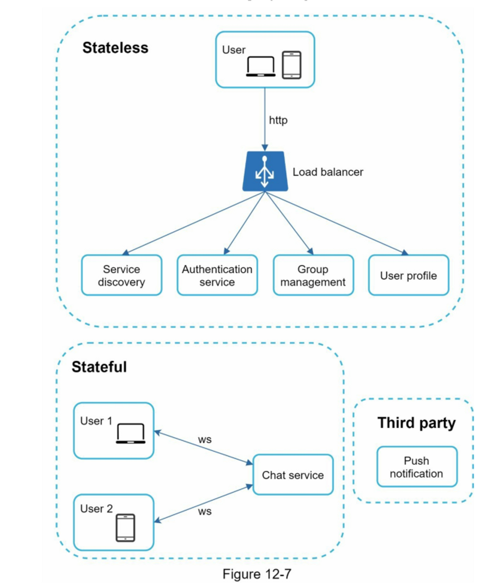

- 无状态的服务

  无状态服务是传统的面向公众的请求/响应服务，用于管理登录、注册、用户资料等。这些是许多网站和应用程序中的常见功能。

  无状态服务位于负载均衡器后面，其工作是根据请求路径将请求路由到正确的服务。这些服务可以是单体的，也可以是单独的微服务。我们不需要自己建立许多这样的无状态服务，因为市场上有一些服务可以很容易地被集成。

  我们将深入讨论的一个服务是服务发现。它的主要工作是给客户提供一个客户可以连接到的聊天服务器的DNS主机名列表。

- 有状态的服务

  唯一有状态的服务是聊天服务。该服务是有状态的，因为每个客户都与一个聊天服务器保持持久的网络连接。在这个服务中，只要服务器仍然可用，客户通常不会切换到另一个聊天服务器。服务发现与聊天服务密切协调，以避免服务器过载。我们将在深入研究中详细介绍。

- 第三方集成

  对于一个聊天应用程序，推送通知是最重要的第三方集成。它是一种在新消息到来时通知用户的方式，即使应用程序没有运行。正确整合推送通知是至关重要的。更多信息请参考第10章 设计一个通知系统。

### 可扩展性

在小范围内，上面列出的所有服务都可以放在一台服务器中。即使以我们设计的规模，理论上也有可能在一个现代云服务器中处理所有的用户连接。服务器可以处理的并发连接数很可能是限制因素。在我们的场景中，在 100w 并发用户的情况下，假设每个用户连接在服务器上需要10K内存（这是一个非常粗略的数字，非常依赖于语言选择），则只需要大约10GB的内存即可将所有连接保存在一个服务器上。

如果我们提出一种将所有内容都放在一台服务器中的设计，这可能会在面试官的脑海中升起一个大大的不好信号。 没有技术专家会在单个服务器中设计这样的规模。由于多种因素，单服务器设计是交易的障碍，单点失败是其中最大的。

然而，从单一的服务器设计开始是完全可以的。只要确保面试官知道这只是一个起点。把我们提到的一切放在一起，图12-8显示了调整后的高层设计。

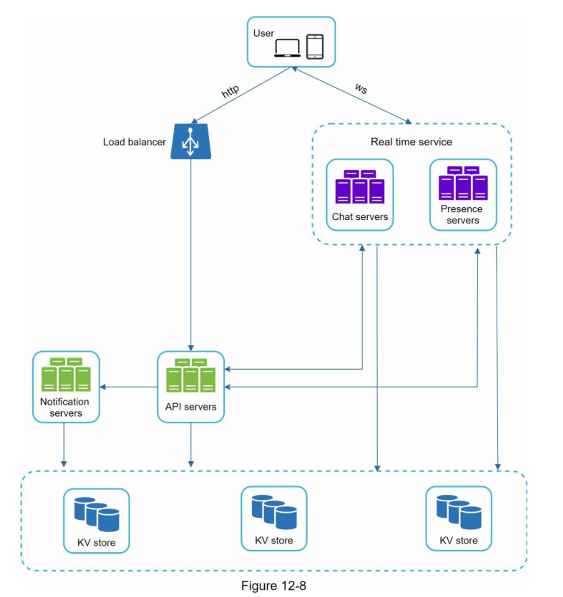

在图12-8中，客户端与聊天服务器保持一个持久的WebSocket连接，用于实时消息传递。

- 聊天服务器促进了信息的发送/接收。
- 在线服务器管理在线/离线状态。
- API服务器处理一切，包括用户登录、注册、更改资料等。
- 通知服务器发送推送通知。
- 最后，键值存储用于存储聊天历史。当一个离线用户上线时，她会看到她以前所有的聊天历史。

### 储存

在这一点上，我们已经准备好了服务器，服务已经开始运行，第三方集成已经完成。在技术栈的深处是数据层。数据层通常需要一些努力才能得到正确的结果。我们必须做出的一个重要决定是，决定使用正确的数据库类型：关系型数据库还是NoSQL数据库？为了做出一个明智的决定，我们将检查数据类型和读/写模式。

在一个典型的聊天系统中存在两类数据。

第一类是通用数据，如用户资料、设置、用户朋友列表。这些数据被存储在强大而可靠的关系数据库中。复制和分片是满足可用性和扩展性要求的常见技术。

第二种是聊天系统特有的：聊天历史数据。了解读/写模式很重要。

- 聊天系统的数据量是巨大的。之前的一项研究[2]显示，Facebook 和 Whatsapp 每天要处理600亿条信息。
- 只有最近的聊天记录被频繁访问。用户通常不会查找旧的聊天记录。
- 虽然在大多数情况下都会查看最近的聊天记录，但用户可能会使用需要随机访问数据的功能，如搜索、查看您的提及内容、跳转到特定的消息等。这些情况应该由数据访问层来支持。
- 一对一聊天应用程序的读写比约为 1:1。

选择正确的存储系统，支持我们所有的使用案例是至关重要的。我们推荐键值存储，理由如下。

- 键值存储允许容易的水平扩展。
- 键值存储为访问数据提供了非常低的延迟。
- 关系型数据库不能很好地处理长尾[3]的数据。当索引变大时，随机访问是很昂贵的。
- 键值存储被其他成熟可靠的聊天应用程序所采用。例如，Facebook 和 Discord 都使用键值存储。Facebook 使用 HBase[4]，而 Discord 使用 Cassandra[5]。
### 数据模型

刚才，我们谈到了使用键值存储作为我们的存储层。最重要的数据是消息数据。让我们仔细看一下。

- 一对一聊天的消息表

  图12-9显示了1对1聊天的消息表。主键是message_id，它有助于决定消息的顺序。我们不能依靠created_at来决定消息的顺序，因为两条消息可以同时创建。

  

- 群聊消息表

  图12-10显示了群聊的消息表。复合主键是（channel_id，message_id）。频道和组在此表示相同的含义。channel_id是分区键，因为群聊天中的所有查询都在一个通道中运行。

  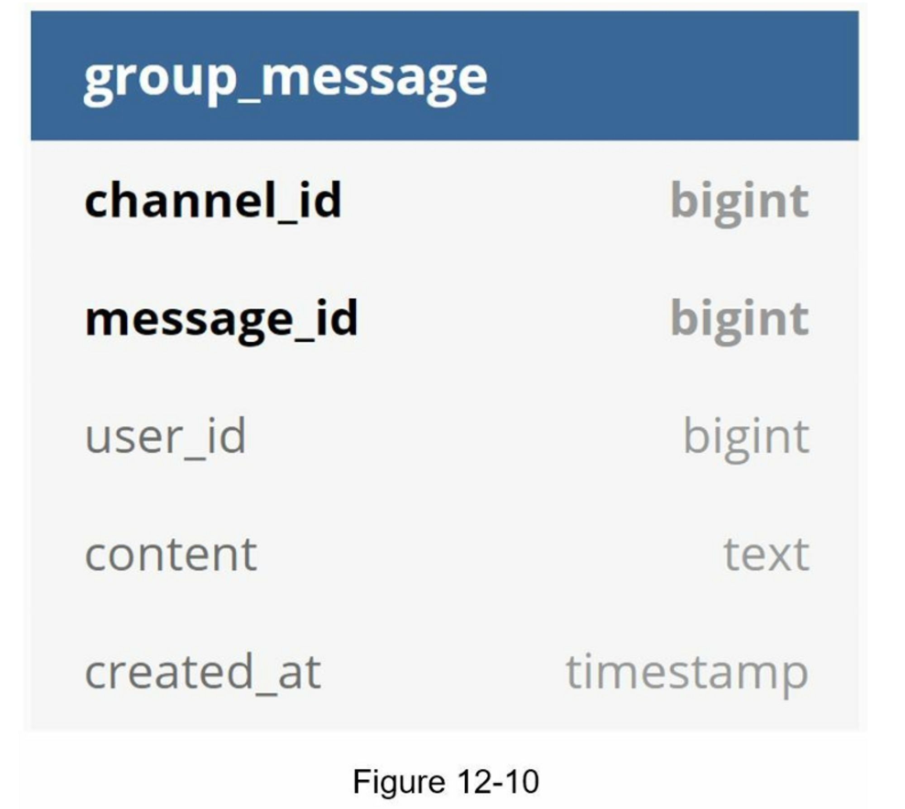

- 消息ID

  如何生成message_id是一个值得探索的有趣话题。Message_id承担着确保消息顺序的责任。为了确定消息的顺序，message_id必须满足以下两个要求。

    - ID 必须唯一。
    - ID应该可以按时间排序，也就是说，新行的ID要比旧行高。

  我们如何才能实现这两项保证呢？我想到的第一个想法是MySql中的 "auto_increment "关键字。然而，NoSQL数据库通常不提供这样的功能。

  第二种方法是使用像Snowflake[6]那样的全局64位序列号发生器。这将在 "第七章：在分布式系统中设计一个唯一的ID生成器 "中讨论。

  最后一种方法是使用本地序列号生成器。本地意味着ID只在一个组内是唯一的。本地ID发挥作用的原因是，在一对一的信道或一个组的信道内维持消息序列就足够了。与全局ID的实现相比，这种方法更容易实现。

## 第3步：深入设计

在系统设计面试中，通常希望你能深入了解高层次设计中的一些组件。对于聊天系统，服务发现、消息流和在线/离线值得深入探讨。

### 服务发现

服务发现的主要作用是根据地理位置、服务器容量等标准，为客户推荐最佳的聊天服务器。Apache Zookeeper [7] 是一个流行的服务发现开源解决方案。它注册了所有可用的聊天服务器，并根据预定义的标准为客户挑选最佳聊天服务器。

图12-11显示了服务发现（Zookeeper）是如何工作的。

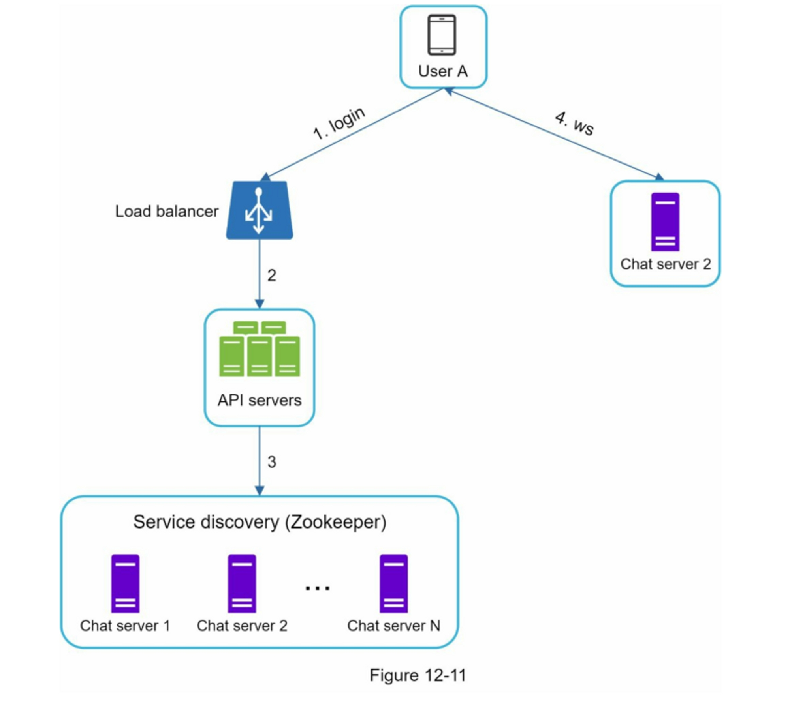

1. 用户A尝试登录APP
2. 负载均衡器发送登录请求到API服务
3. 在后端认证用户后，服务发现为用户A找到最佳的聊天服务器。在这个例子中，服务器2被选中，服务器信息被返回给用户A。
4. 用户A通过 WebSocket 连接到聊天服务器2。

### 消息流

了解一个聊天系统的端到端流程是很有趣的。在本节中，我们将探讨1对1的聊天流程、跨多个设备的信息同步和群组聊天流程。

#### 1对1聊天

图12-12解释了当用户A向用户B发送消息时发生的情况。

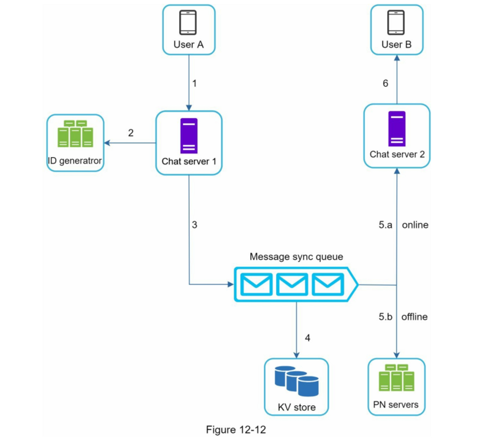

1. 用户A向聊天服务器1发送了一条聊天信息。
2. 聊天服务器1从ID生成器获得一个信息ID。
3. 聊天服务器1将消息发送至消息同步队列。
4. 消息被储存在一个键值存储中。
5. a. 如果用户B在线，信息被转发到用户B所连接的聊天服务器2。
6. b. 如果用户B处于离线状态，则从推送通知（PN）服务器发送推送通知。
7. 聊天服务器2将消息转发给用户B，用户B和聊天服务器2之间有一个持久的WebSocket连接。
#### 多个设备间的信息同步

许多用户有多个设备。我们将解释如何在多个设备上同步消息。图12-13显示了一个消息同步的例子。

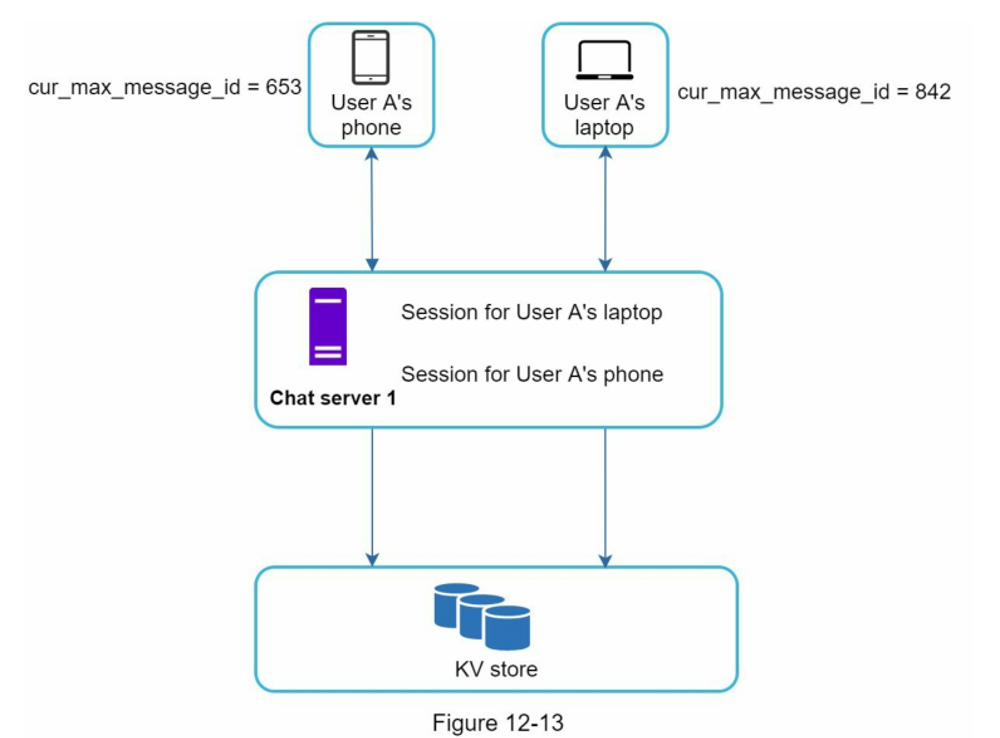

在图12-13中，用户A有两台设备：一台手机和一台笔记本电脑。当用户A用手机登录聊天应用程序时，它与聊天服务器1建立了一个WebSocket连接。同样地，笔记本电脑和聊天服务器1之间也有一个连接。

每个设备都维护着一个叫做cur_max_message_id的变量，它记录着设备上最新的消息ID。满足以下两个条件的消息被认为是新消息。

- 收件人ID等于当前登录的用户ID。
- 键值存储中的消息ID大于cur_max_message_id

由于每个设备上都有不同的cur_max_message_id，信息同步很容易，因为每个设备都可以从KV商店获得新的信息。

#### 群组聊天流程

与一对一的聊天相比，群组聊天的逻辑更加复杂。图12-14和12-15解释了这个流程。

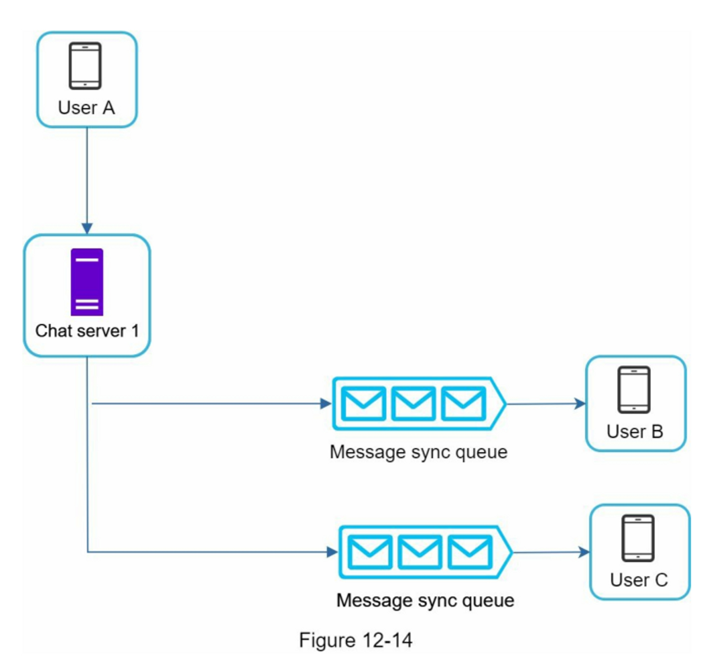

图12-14解释了用户A在群聊中发送消息时发生的情况。假设群里有3个成员（用户A、用户B和用户C）。首先，用户A的消息被复制到每个组员的消息同步队列中：一个给用户B，另一个给用户C。你可以把消息同步队列看成是一个收件人的收件箱。这种设计选择很适合小群组聊天，因为。

- 它简化了信息同步流程，因为每个客户只需要检查自己的收件箱就可以获得新的信息。
- 当群组人数较少时，在每个收件人的收件箱中存储一份副本并不太昂贵。

微信使用类似的方法，它将一个群组限制在500个成员[8]。然而，对于拥有大量用户的群组来说，为每个成员存储一份信息副本是不可接受的。

在收件人方面，一个收件人可以接收来自多个用户的信息。每个收件人都有一个收件箱（消息同步队列），其中包含来自不同发送者的消息。图12-15说明了这种设计。

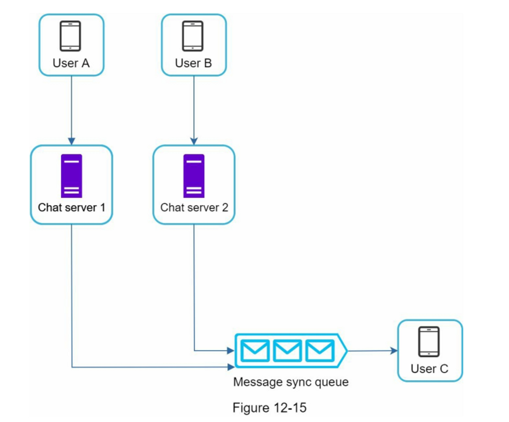

### 在线状态

在线状态指示器是许多聊天应用程序的一个基本功能。通常情况下，你可以在用户的个人照片或用户名旁边看到一个绿点。本节解释幕后发生的事情。

在高层设计中，在线服务器负责管理在线状态，并通过WebSocket与客户端进行通信。有几个流程会触发在线状态的变化。让我们来看看它们中的每一个。

#### 用户登入

  用户登录的流程在 "服务发现 "一节中解释。在客户端和实时服务之间建立WebSocket连接后，用户A的在线状态和最后活动时间戳被保存在KV存储中。状态指示器显示用户在登录后处于在线状态。

  

#### 用户登出

  当用户注销登录时，会经历如图 12-17 所示的用户注销流程。 KV store 中在线状态变为离线状态。 状态指示器显示用户离线。

  

#### 用户断开连接

  我们都希望我们的互联网连接是一致和可靠的。然而，情况并非总是如此；因此，我们必须在设计中解决这个问题。当一个用户从互联网上断开连接时，客户端和服务器之间的持久连接就会丢失。处理用户断开连接的一个天真的方法是将用户标记为离线，并在连接重新建立时将其状态改为在线。然而，这种方法有一个重大缺陷。用户在短时间内频繁地断开和重新连接到互联网是很常见的。例如，当用户通过隧道时，网络连接可能会打开和关闭。在每次断开/重新连接时更新在线状态会使存在指标变化得太频繁，导致用户体验不佳。

  我们引入一个心跳机制来解决这个问题。定期地，一个在线客户端向状态服务器发送一个心跳事件。如果状态服务器在一定时间内收到心跳事件，比如说来自客户端的X秒，那么用户被认为是在线的。否则，它就处于离线状态。

  在图12-18中，客户端每5秒向服务器发送一个心跳事件。在发送了3个心跳事件后，客户端被断开连接，并且在x=30秒内没有重新连接（这个数字是任意选择的，以演示逻辑）。在线状态被改变为离线。

  

#### 在线状态输出

  用户 A 的好友如何知道状态变化？ 图 12-19 解释了它是如何工作的。
  状态服务器使用发布-订阅模型，其中每个朋友对都维护一个频道。 当用户A的在线状态发生变化时，将事件发布到三个频道，频道A-B，A-C，A-D。 这三个频道分别由用户 B、C 和 D 订阅。 因此，朋友们很容易获得在线状态更新。 客户端和服务器之间的通信是通过实时 WebSocket 进行的。

  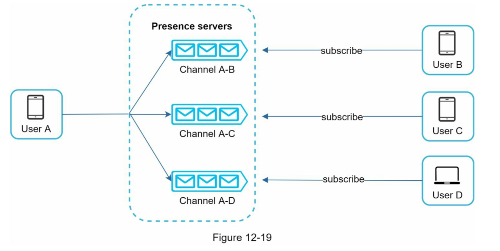

  上述设计对小规模的用户群是有效的。例如，微信使用类似的方法，因为它的用户群上限为500人。对于较大的群组，通知所有成员的在线状态是昂贵和耗时的。假设一个群组有100,000个成员。每一个状态变化将产生100,000个事件。为了解决性能瓶颈，一个可能的解决方案是只在用户进入群组或手动刷新好友列表时获取在线状态。

## 第4步：总结

在本章中，我们介绍了一个聊天系统架构，它支持1对1的聊天和小群组聊天。WebSocket用于客户端和服务器之间的实时通信。聊天系统包含以下组件：用于实时消息传递的聊天服务器、用于管理在线状态的状态服务器、用于发送推送通知的推送通知服务器、用于聊天历史持久性的键值存储以及用于其他功能的API服务器。

如果你在面试结束时有多余的时间，这里有额外的谈话要点：

- 扩展聊天应用程序以支持媒体文件，如照片和视频。媒体文件的大小明显大于文本。压缩、云存储和缩略图是值得讨论的话题。
- 端到端加密。Whatsapp支持信息的端到端加密。只有发件人和收件人可以阅读信息。有兴趣的读者请参考参考资料中的文章[9]。
- 在客户端缓存信息，可以有效地减少客户端和服务器之间的数据传输。
- 提高加载时间。Slack建立了一个地理分布的网络来缓存用户的数据、频道等，以获得更好的加载时间[10]。
- 故障处理。
    - 聊天服务器错误。可能有数十万，甚至更多的，坚持不懈的连接到一个聊天服务器。如果一个聊天服务器离线，服务发现（Zookeeper）会提供一个新的聊天服务器，让客户建立新的连接。
    - 消息重发机制。重试和排队是重发消息的常用技术。

祝贺你走到了这一步! 现在拍拍自己的屁股吧，干得漂亮!

## 参考资料

  - [1] Erlang at Facebook: https://www.erlang-
  [factory.com/upload/presentations/31/EugeneLetuchy-ErlangatFacebook.pdf](http://factory.com/upload/presentations/31/EugeneLetuchy-ErlangatFacebook.pdf)
  - [2] Messenger and WhatsApp process 60 billion messages a day:
    [https://www.theverge.com/2016/4/12/11415198/facebook-messenger-whatsapp-number-messages-vs-sms-f8-2016](https://www.theverge.com/2016/4/12/11415198/facebook-messenger-whatsapp-number-)
  - [3] Long tail: [https://en.wikipedia.org/wiki/Long_tail](https://en.wikipedia.org/wiki/Long_tail)
  - [4] The Underlying Technology of Messages: [https://www.facebook.com/notes/facebook-engineering/the-underlying-technology-of-messages/454991608919/](https://www.facebook.com/notes/facebook-)
  - [5] How Discord Stores Billions of Messages: [https://blog.discordapp.com/how-discord-stores-billions-of-messages-7fa6ec7ee4c7](https://blog.discordapp.com/how-discord-)
  - [6] Announcing Snowflake: [https://blog.twitter.com/engineering/en_us/a/2010/announcing-snowflake.html](https://blog.twitter.com/engineering/en_us/a/2010/announcing-)
  - [7] Apache ZooKeeper: [https://zookeeper.apache.org/](https://zookeeper.apache.org/)
  - [8] From nothing: the evolution of WeChat background system (Article in Chinese):
  [https://www.infoq.cn/article/the-road-of-the-growth-weixin-background](https://www.infoq.cn/article/the-road-of-the-growth-weixin-background)
  - [9] End-to-end encryption: [https://faq.whatsapp.com/en/android/28030015/](https://faq.whatsapp.com/en/android/28030015/)
  - [10] Flannel: An Application-Level Edge Cache to Make Slack Scale:
  [https://slack.engineering/flannel-an-application-level-edge-cache-to-make-slack-scale-b8a6400e2f6b](https://slack.engineering/flannel-an-application-level-edge-cache-to-make-slack-scale-)