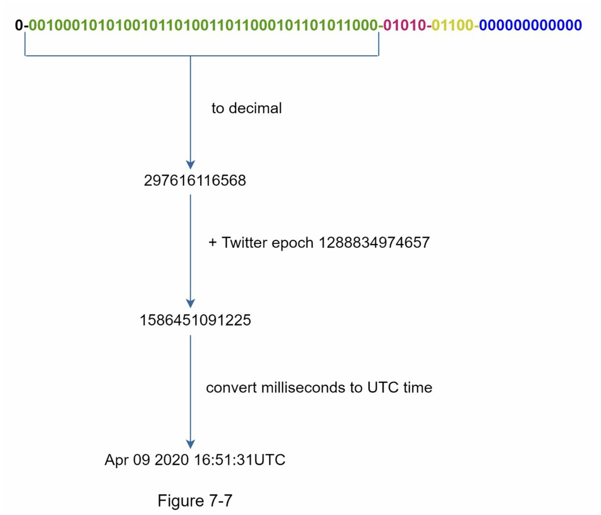
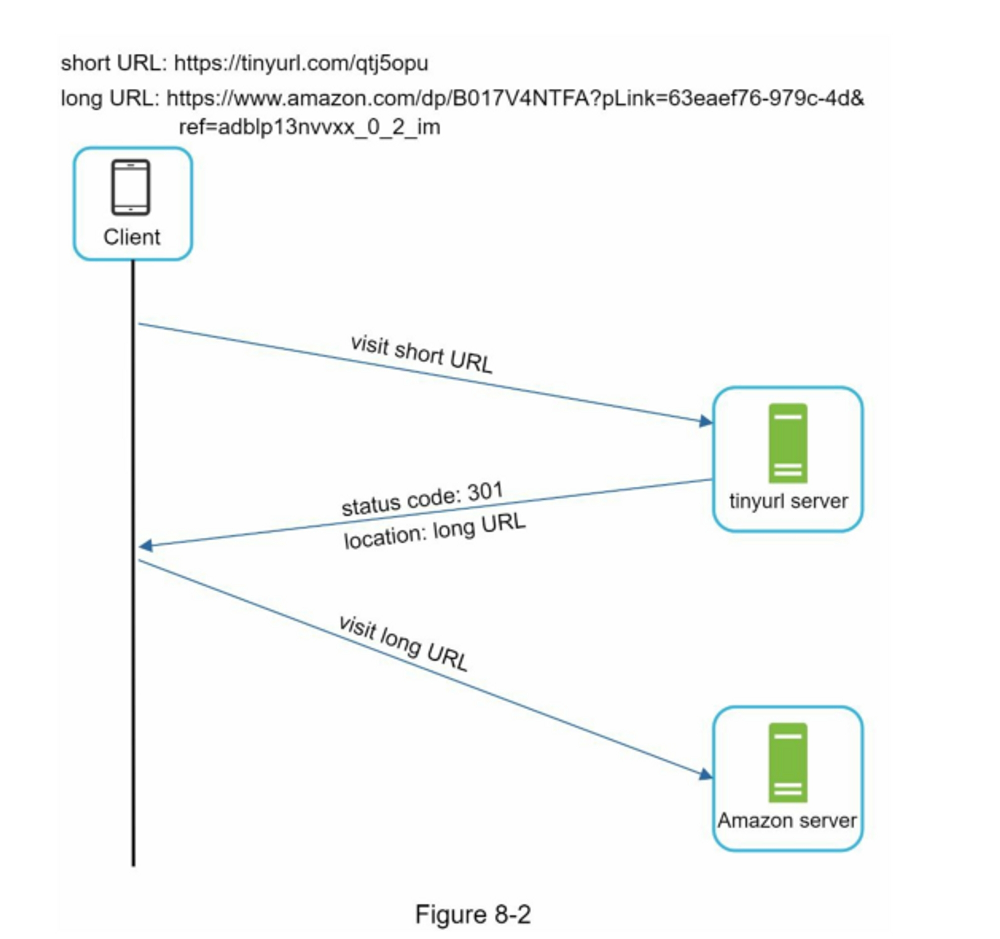
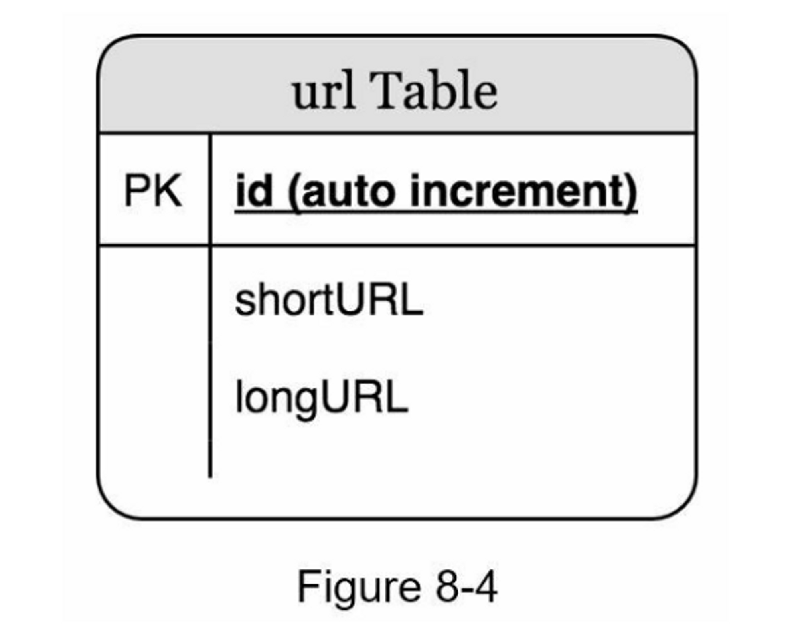
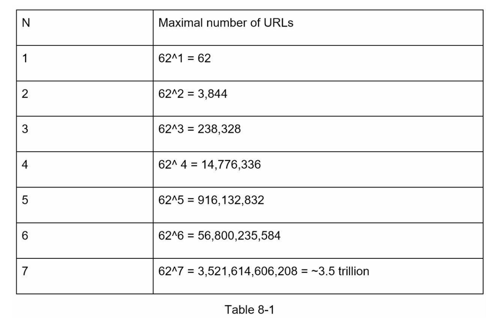
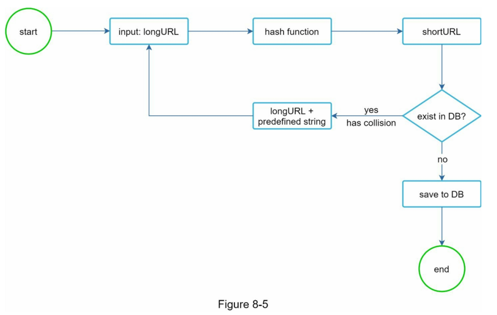
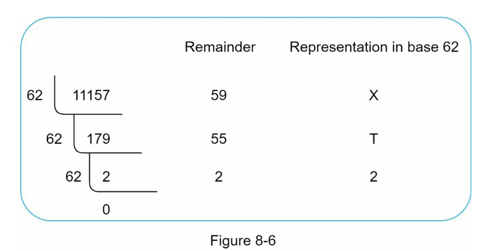
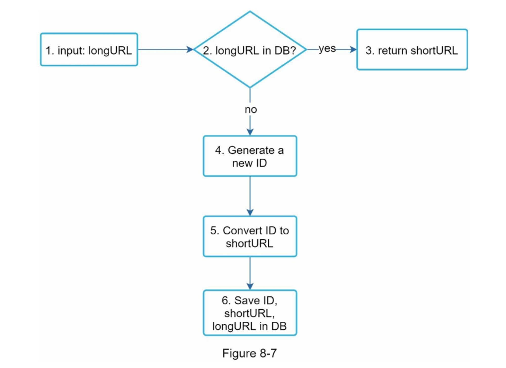

<!-- TOC -->

  * [第1步 ：了解问题并确定设计范围](#第1步了解问题并确定设计范围)
    * [粗略估计系统量级](#粗略估计系统量级)
  * [第2步：提出高层次的设计方案并获得认同](#第2步提出高层次的设计方案并获得认同)
    * [API 端点](#api-端点)
    * [URL 重定向](#url-重定向)
    * [缩短网址](#缩短网址)
  * [第3步：深入设计](#第3步深入设计)
    * [数据模型](#数据模型)
    * [哈希函数](#哈希函数)
      * [哈希值的长度](#哈希值的长度)
      * [哈希+碰撞解决](#哈希碰撞解决)
      * [base 62 转换](#base-62-转换)
      * [两种方法的比较](#两种方法的比较)
    * [URL 缩短的深入研究](#url-缩短的深入研究)
    * [URL重定向的深入研究](#url重定向的深入研究)
  * [第4步：总结](#第4步总结)
  * [参考资料](#参考资料)
<!-- TOC -->

# 短网址设计

在这一章中，我们将解决一个有趣而经典的系统设计面试问题：设计一个像tinyurl一样的URL缩短服务。

## 第1步：了解问题并确定设计范围

系统设计的面试问题是故意留有余地的。为了设计一个精心设计的系统，关键是要问清楚问题。

候选人：你能举个例子说明URL缩短器的工作原理吗？

面试官：假设 URL [https://www.systeminterview.com/q=chatsystem&c=loggedin&v=v3&l=long](https://www.systeminterview.com/q=chatsystem&c=loggedin&v=v3&l=long) 是原始 URL。你的服务创建了一个长度较短的别名：[https://tinyurl.com/y7keocwj](https://tinyurl.com/y7keocwj%E3%80%82%E5%A6%82%E6%9E%9C%E6%82%A8%E5%8D%95%E5%87%BB%E5%88%AB%E5%90%8D%EF%BC%8C%E5%AE%83%E4%BC%9A%E5%B0%86%E6%82%A8%E9%87%8D%E5%AE%9A%E5%90%91%E5%88%B0%E5%8E%9F%E5%A7%8B)。如果你单击较短的别名URL，它会将你重定向到原始 URL。

候选人：流量是多少？

面试官：每天产生1亿个[UR](https://www.notion.so/f56f4bc43ae9455780d5c541cb762a83)L。

候选人：缩短后的URL有多长？

面试官：越短越好。

候选人：缩短的网址中允许使用哪些字符？

面试官：短网址可以是数字（0-9）和字符（a-z，A-Z）的组合。

候选人：缩短的URL可以删除或更新吗？

面试官：为了简单起见，我们假设缩短的URL不能被删除或更新。

以下是基本用例：

1. URL缩短：给定一个长的URL => 返回一个短得多的URL
2. URL重定向：给定一个短的URL => 重定向到原来的URL
3. 高可用性、可扩展性和容错考虑

### 粗略估计系统量级

- 写操作：每天产生1亿个URL。
- 每秒写操作：亿/24/3600 = 1160
- 读操作：假设读操作和写操作的比例为10:1，读每秒操作：1160 * 10 = 11,600
- 假设 URL 缩短服务将运行 10 年，这意味着我们必须支持 1 亿 * 365 * 10 = 3650 亿条记录。
- 假设平均 URL 长度为 100。
- 10 年的存储需求：3650 亿 * 100 字节 * 10 年 = 365 TB

重要的是，你要与面试官一起探讨假设和计算，以便你们两个人都在同一起跑线上。

## 第2步：提出高层次的设计方案并获得认同

在本节中，我们将讨论 API 端点、URL 重定向和 URL 缩短。

### API 端点

API端点促进了客户`和服务器之间的通信。我们将设计REST风格的API。如果你不熟悉restful API，你可以查阅外部资料，比如参考资料中的资料[1]。一个URL缩短器主要需要两个API端点。

1. 网址缩短。 要创建一个新的短 URL，客户端发送一个 POST 请求，其中包含一个参数：原始长 URL。 API 如下所示：

   **POST api/v1/data/shorten**

    - 请求参数：{longUrl: longURLString}。
    - 返回 shortUR
2. URL重定向。为了将一个短的URL重定向到相应的长的URL，一个客户端发送一个GET请求。该API看起来像这样：

   **GET api/v1/shortUrl**

    - 返回用于HTTP重定向的`longURL
### URL 重定向

图8-1显示了当你在浏览器上输入一个tinyurl时会发生什么。一旦服务器收到tinyurl请求，它就会用301重定向将短网址改为长网址。

客户端和服务器之间的详细通信情况如图8-2所示。

值得在这里讨论的一件事是 301 重定向与 302 重定向。

- **301重定向**。301重定向表明，请求的URL被 "永久 "地移到了长URL上。由于是永久重定向，浏览器会缓存响应，对同一URL的后续请求将不会被发送到URL缩短服务上。相反，请求将直接被重定向到长网址服务器。
- **302重定向**。302重定向意味着URL被 "暂时 "移到长URL上，这意味着对同一URL的后续请求将首先被发送到URL缩短服务上。然后，它们会被重定向到长网址服务器。

每种重定向方法都有其优点和缺点。如果优先考虑**减少服务器负载**，使用301重定向是有意义的，因为只有同一URL的第一个请求被发送到URL缩短服务器。然而，如果分析是重要的，302重定向是一个更好的选择，因为它可以更容易地**跟踪点击率和点击的来源。**

实现URL重定向的最直观的方法是**使用哈希表**。假设哈希表存储<shortURL, longURL>对，URL重定向可以通过以下方式实现。

- 获取longURL: `longURL = hashTable.get(shortURL)`
- 一旦你得到longURL，就执行URL重定向。
### 缩短网址

让我们假设短的URL看起来像这样：[www.tinyurl.com/{hashValue}](http://www.tinyurl.com/%7BhashValue%7D%E3%80%82%E4%B8%BA%E4%BA%86%E6%94%AF%E6%8C%81%E7%BC%A9%E7%9F%ADURL%E7%9A%84%E7%94%A8%E4%BE%8B%EF%BC%8C%E6%88%91%E4%BB%AC%E5%BF%85%E9%A1%BB%E6%89%BE%E5%88%B0%E4%B8%80%E4%B8%AA%E5%93%88%E5%B8%8C%E5%87%BD%E6%95%B0fx%EF%BC%8C%E5%B0%86%E9%95%BFURL%E6%98%A0%E5%B0%84%E5%88%B0hashValue%EF%BC%8C%E5%A6%82%E5%9B%BE8-3%E6%89%80%E7%A4%BA%E3%80%82)。为了支持缩短URL的用例，我们必须找到一个哈希函数fx，将长URL映射到hashValue，如图8-3所示。

哈希函数必须满足以下要求。

- 每个longURL必须被散列成一个hashValue。
- 每个hashValue都可以被映射回longURL。

哈希函数的详细设计将深入讨论。

## 第3步：深入设计

到目前为止，我们已经讨论了URL缩短和URL重定向的高层设计。在本节中，我们将深入探讨以下内容：数据模型、哈希函数、URL缩短和URL重定向。

### 数据模型

在高层设计中，所有的东西都存储在一个哈希表中。这是一个很好的起点；然而，这种方法在现实世界的系统中是不可行的，因为内存资源是有限的和昂贵的。一个更好的选择是将<shortURL, longURL>映射存储在一个关系数据库中。图8-4显示了一个简单的数据库表设计。简化版的表包含3列：id、shortURL、longURL。

### 哈希函数

哈希函数用于将一个长的URL哈希成一个短的URL，也称为hashValue。

#### 哈希值的长度

hashValue由[0-9, a-z, A-Z]中的字符组成，包含10+26+26=62个可能的字符。要计算hashValue的长度，请找出最小的n，使62^n≥365亿。根据估计，系统必须支持多达 3650 亿个 URL。 表 8-1 显示了 hashValue 的长度和它可以支持的相应的最大 URL 数。

当n = 7时，62 ^ n = ~3.5万亿，3.5万亿足以容纳3650亿个URL，所以hashValue的长度为7。

我们将探讨两种类型的URL缩短器的哈希函数。第一种是 "哈希+碰撞解决"，第二种是 "base 62 转换"。让我们逐一来看看它们。

#### 哈希+碰撞解决

为了缩短长的URL，我们应该实现一个散列函数，将长的URL散列成一个7个字符的字符串。一个直接的解决方案是使用知名的哈希函数，如CRC32、MD5或SHA-1。下表比较了在这个URL（[https://en.wikipedia.org/wiki/Systems_design](https://en.wikipedia.org/wiki/Systems_design)）上应用不同哈希函数后的哈希结果：

如表8-2所示，即使是最短的哈希值（来自CRC32）也太长了（超过7个字符）。我们怎样才能使它更短呢？

第一种方法是收集哈希值的前7个字符；然而，这种方法会导致哈希碰撞。为了解决哈希碰撞，我们可以递归地追加一个新的预定义字符串，直到不再发现碰撞。这一过程在图8-5中得到了解释。

这种方法可以消除碰撞；但是，查询数据库以检查每个请求是否存在短网址的成本很高。一种叫做**Bloom过滤器**的技术[2]可以提高性能。布隆过滤器是一种空间效率高的概率技术，用来测试一个元素是否是一个集合的成员。更多细节请参考参考资料[2]。

#### base 62 转换

Base 转换是 URL 缩短器常用的另一种方法。 Base 转换有助于在不同的数字表示系统之间转换成相同的数字。 使用 Base 62 转换，因为 hashValue 有 62 个可能的字符。 让我们用一个例子来解释转换的工作原理：将 $11157_{10}$ 转换为 base 62 表示（$11157_{10}$ 在 base 10 系统中表示 11157）。

- 从名字上看，base 62 是一种使用 62 个字符进行编码的方式。 映射是：
  0-0, ..., 9-9, 10-a, 11-b, ..., 35-z, 36-A, ..., 61-Z，其中“a”代表 10，“Z” ' 代表 61，等等。
- $11157_{10}$  = 2 x $62^2$ + 55 x $62^1$ + 59 x $62^0$ = [2, 55, 59] -> [2, T, X] 以 base 62 表示。 对话过程如图8-6所示。

  

- 因此，短网址是：https://tinyurl.com/2TX

#### 两种方法的比较

  下表显示了两种方法的差异。

  | 哈希+碰撞解决 | base 62 转换 |
  | --- | --- |
  | 固定短URL长度 | 短URL长度不固定，它随着 id 变化 |
  | 不需要唯一ID生成器 | 该选项依赖于唯一ID生成器 |
  | 可能出现冲突，必须解决 | 碰撞是不可能的，因为 ID 是唯一的 |
  | 不可能计算出下一个可用的短网址，因为它不依赖于ID。 | 如果新条目的 ID 递增 1，则很容易找出下一个可用的短 URL。 这可能是一个安全问题。 |

### URL 缩短的深入研究

作为系统的核心部分之一，我们希望URL缩短的流程在逻辑上是简单和实用的。在我们的设计中使用了62进制转换。我们建立了以下图表（图8-7）来演示这个流程。

1. longURL 是输入的
2. 系统检查 longURL 是否存在于数据库中
3. 如果是的话，这意味着longURL之前被转换为shortURL。在这种情况下，从数据库中获取shortURL并将其返回给客户端。
4. 如果不是，longURL是新的。一个新的唯一ID（主键）由唯一ID生成器生成。
5. 使用base 62转换将ID转换为shortURL。
6. 用ID、shortURL和longURL创建一个新的数据库记录。

为了使流程更容易理解，让我们看一个具体的例子。

- 假设输入的longURL是：https://en.wikipedia.org/wiki/Systems_design
- 唯一ID生成器返回ID：2009215674938
- 使用62进制（base62）转换将ID转换为shortURL。ID（2009215674938）被转换为 "zn9edcu"。
- 将ID、shortURL和longURL保存到数据库，如表8-4所示。

  

值得一提的是分布式唯一 ID 生成器。 它的主要功能是生成全局唯一 ID，用于创建 shortURL。 在高度分布式的环境中，实现唯一 ID 生成器具有挑战性。 幸运的是，我们已经在“第 7 章：在分布式系统中设计唯一 ID 生成器”中讨论了一些解决方案。 你可以回过头来回顾它来刷新你的记忆。

### URL重定向的深入研究

图 8-8 显示了 URL 重定向的详细设计。 由于读取多于写入，<shortURL, longURL> 映射存储在缓存中以提高性能。

URL重定向的流程总结如下：

- 一个用户点击了一个短的URL链接：https://tinyurl.com/zn9edcu
- 负载均衡器将请求转发给网络服务器
- 如果shortURL已经在缓存中，直接返回longURL。
- 如果短URL不在缓存中，从数据库中获取长URL。如果它不在数据库中，很可能是用户输入了一个无效的短网址。
- longURL被返回给用户。
## 第4步：总结

在本章中，我们讨论了 API 设计、数据模型、哈希函数、URL 缩短和 URL 重定向。

如果在面试结束时有多余的时间，这里有几个额外的谈话要点：

- 速率限制器：我们可能面临的一个潜在安全问题是恶意用户发送大量的 URL 缩短请求。 速率限制器有助于根据 IP 地址或其他过滤规则过滤掉请求。 如果您想重温有关速率限制的记忆，请参阅“第 4 章：设计速率限制器”。
- Web 服务器扩展：由于 Web 层是无状态的，因此很容易通过添加或删除 Web 服务器来扩展 Web 层。
- 数据库的扩展。数据库复制和分片是常见的技术。
- 分析。数据对商业成功越来越重要。将分析解决方案整合到URL缩短器中，可以帮助回答一些重要的问题，如有多少人点击一个链接？他们何时点击链接？等等。
- 可用性、一致性和可靠性。这些概念是任何大型系统成功的核心。我们在第1章中对它们进行了详细讨论，请对这些主题进行复习记忆

祝贺你走到了这一步！现在拍拍自己的屁股吧。干得漂亮！

## 参考资料

[1] A RESTful Tutorial: [https://www.restapitutorial.com/index.html](https://www.restapitutorial.com/index.html)

[2] Bloom filter: [https://en.wikipedia.org/wiki/Bloom_filter](https://en.wikipedia.org/wiki/Bloom_filter)