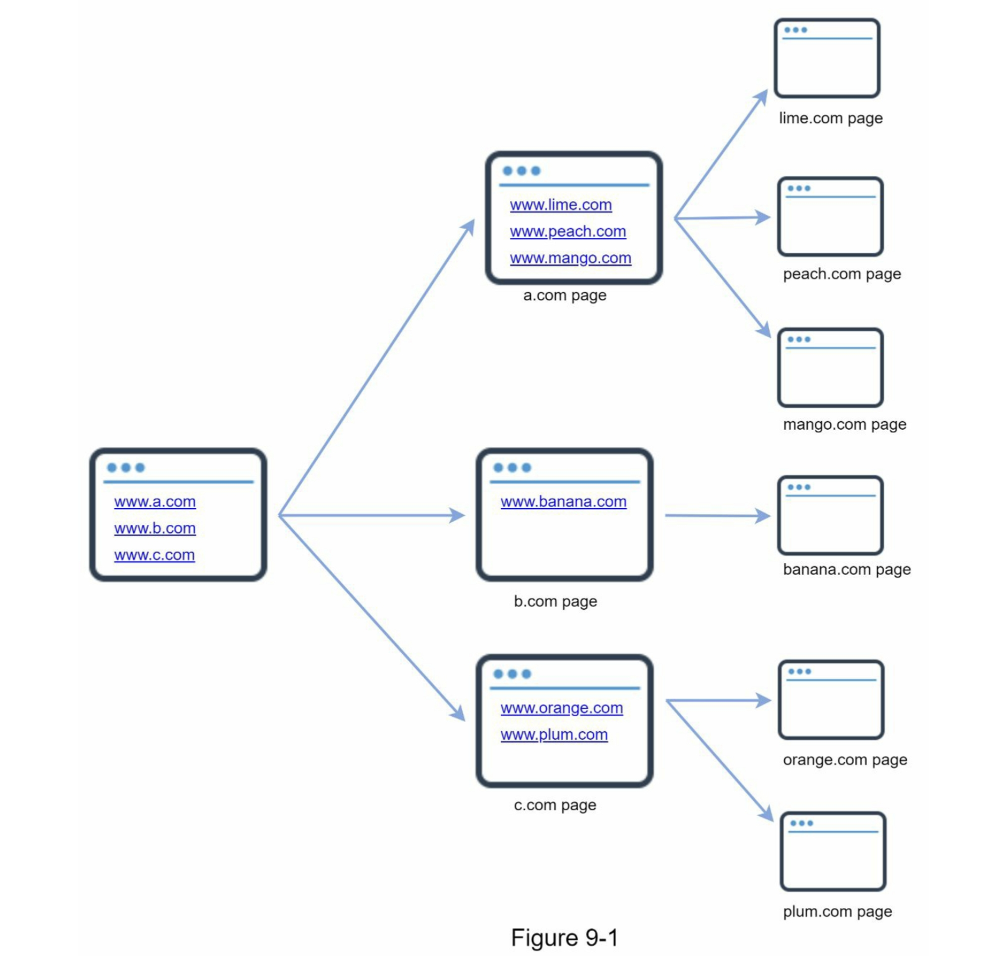
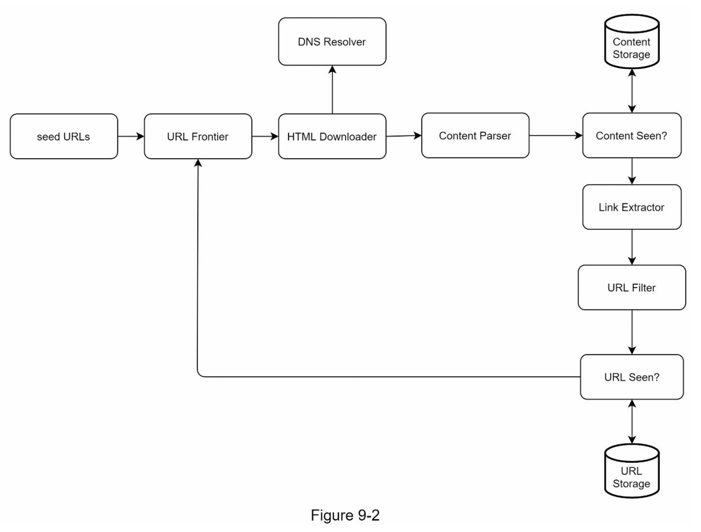
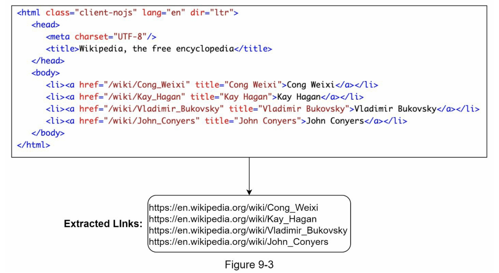
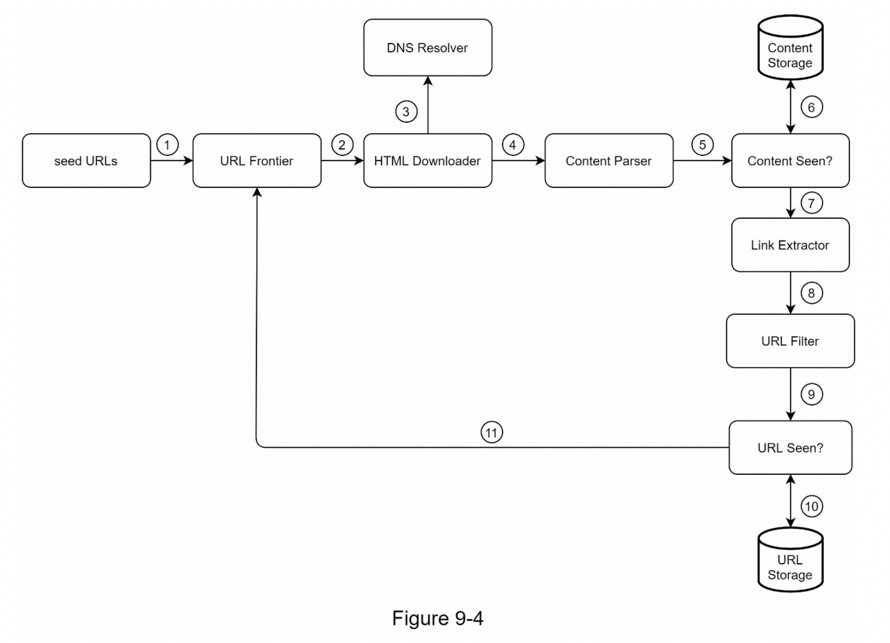
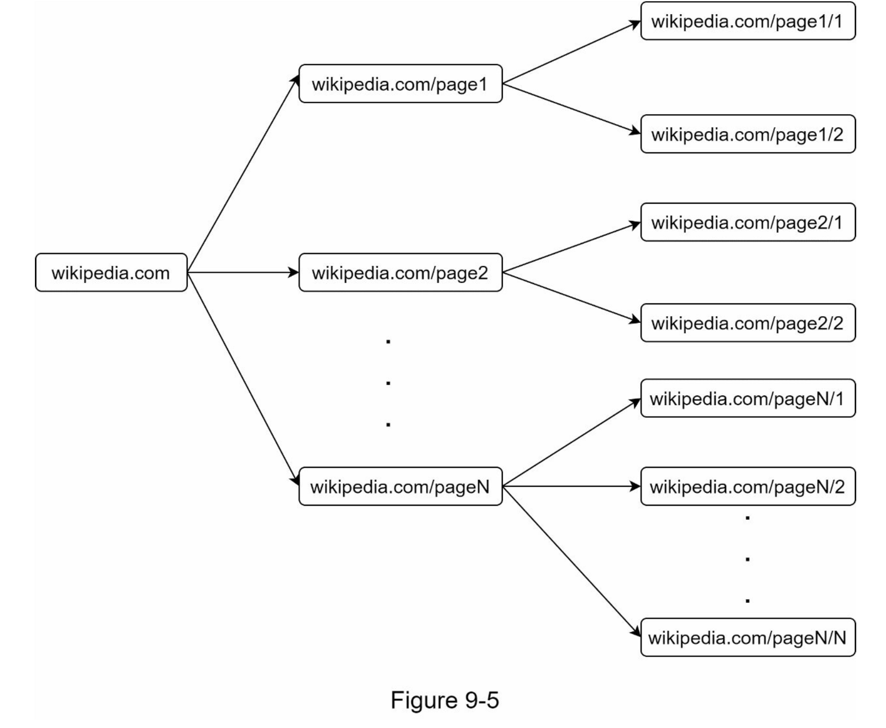
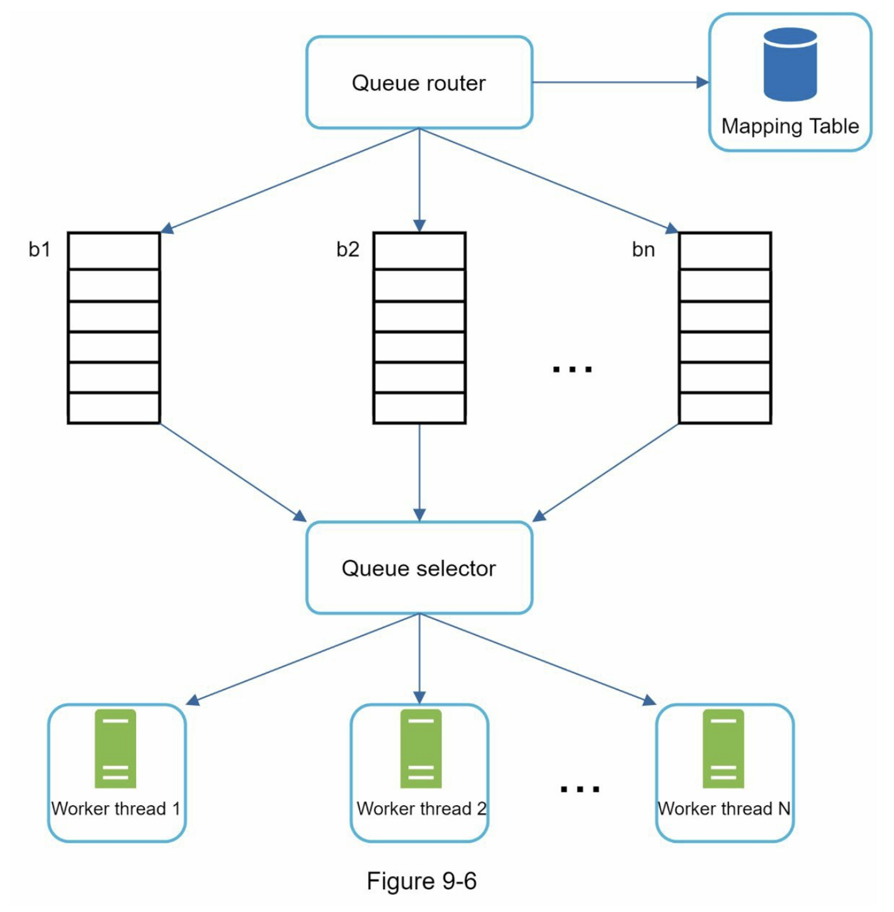
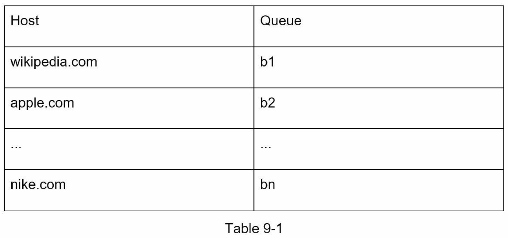
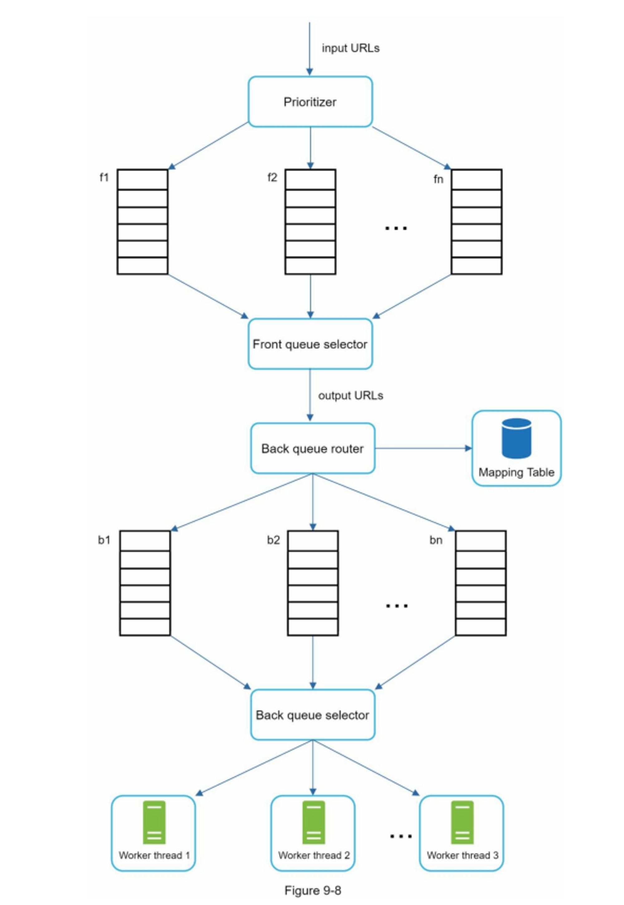
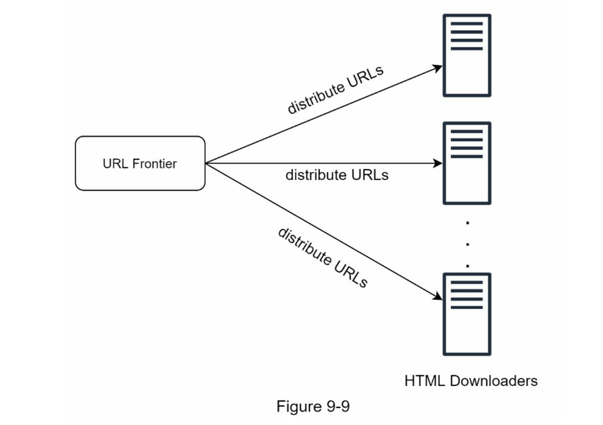
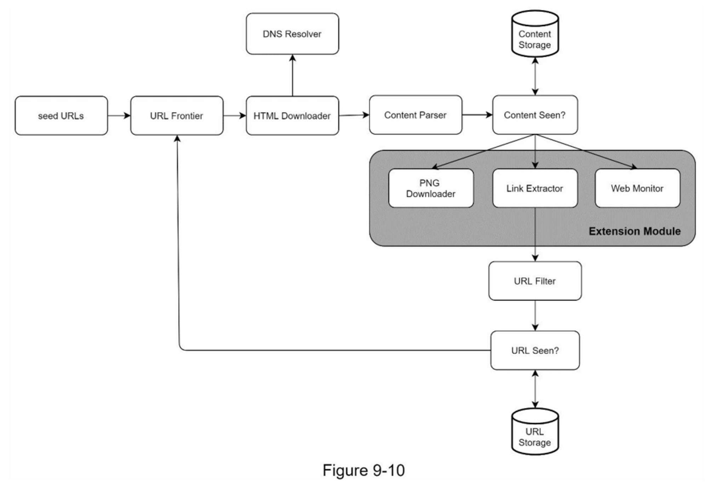

<!-- TOC -->
  * [第1步：了解问题并确定设计范围](#第1步了解问题并确定设计范围)
    * [粗略估算](粗略估算#)
  * [第2步：提出高层次的设计方案并获得认同](#第2步提出高层次的设计方案并获得认同)
    * [Seed URLs](#seed-urls)
    * [URL Frontier](#url-frontier)
    * [HTML Downloader](#html-downloader)
    * [DNS Resolver](#dns-resolver)
    * [Content Parser](#content-parser)
    * [Content Seen?](#content-seen)
    * [Content Storage](#content-storage)
    * [URL Extractor](#url-extractor)
    * [URL Filter](#url-filter)
    * [URL Seen？](#url-seen)
    * [URL Storage](#url-storage)
    * [网络爬虫工作流程](#网络爬虫工作流程)
  * [第3步：深入设计](#第3步深入设计)
    * [DFS vs BFS](#dfs-vs-bfs)
    * [URL Frontier](#url-frontier)
    * [HTML 下载器](#html-下载器)
      * [Robots.txt](#robotstxt)
      * [性能优化](#性能优化)
    * [鲁棒性](#鲁棒性)
    * [可扩展性（Extensibility）](#可扩展性extensibility)
    * [检测并避免有问题的内容](#检测并避免有问题的内容)
  * [第4步：总结](#第4步总结)
  * [参考资料](#参考资料)
<!-- TOC -->

# 网络爬虫设计

本章重点介绍网络爬虫设计：一道有趣且经典的系统设计面试题。

网络爬虫被称为机器人或蜘蛛。搜索引擎广泛使用它来发现 Web 上的新内容或更新内容。内容可以是网页、图像、视频、PDF 文件等。网络爬虫首先收集一些网页，然后按照这些页面上的链接收集新内容。图 9-1 显示了抓取过程的可视化示例。



爬虫有多种用途：

- 搜索引擎索引：这是最常见的用例。爬虫收集网页以为搜索引擎创建本地索引。例如，Googlebot 是 Google 搜索引擎背后的网络爬虫。
- 网络存档：这是从网络收集信息以保存数据以备将来使用的过程。例如，许多国家图书馆运行爬虫来存档网站。著名的例子是美国国会图书馆 [1] 和欧盟网络档案馆 [2]。
- 网络挖掘：网络的爆炸式增长为数据挖掘提供了前所未有的机会。 网络挖掘有助于从 Internet 中发现有用的知识。例如，顶级金融公司使用爬虫下载股东大会和年度报告以了解公司的关键举措。
- 网络监控：这些爬虫有助于监控 Internet 上的版权和商标侵权行为。例如，Digimarc [3] 利用爬虫来发现盗版作品和报告。

开发网络爬虫的复杂性取决于我们打算支持的规模。它可以是一个只需要几个小时即可完成的小型学校项目，也可以是一个需要专门的工程团队不断改进的大型项目。因此，我们将在下面探讨支持的规模和功能。

## 第1步：了解问题并确定设计范围

网络爬虫的基本算法很简单：

- 给定一组URLs，下载所有由URLs指向的网页。
- 从这些网页中提取 URL。
- 将新的 URL 添加到要下载的 URL 列表中。重复这3个步骤。

网络爬虫真的像这个基本算法一样简单吗？不完全是。设计一个高度可扩展的网络爬虫是一项极其复杂的任务。任何人都不太可能在面试时间内设计出一个庞大的网络爬虫。在进入设计之前，我们必须提出问题以**了解需求并建立设计范围**：

候选人：爬虫的主要目的是什么？它用于搜索引擎索引、数据挖掘或其他用途吗？

面试官：搜索引擎索引。

候选人：网络爬虫每个月收集多少网页？

采访者：10 亿页。

候选人：包括哪些内容类型？仅 HTML 还是其他内容类型（如 PDF 和图像）？

面试官：只有 HTML。

候选人：我们是否考虑新增或编辑的网页？

面试官：是的，我们应该考虑新添加或编辑的网页。

候选人：我们需要存储从网络上爬取的 HTML 页面吗？

面试官：是的，最多5年

应聘者：我们如何处理内容重复的网页？

面试官：重复内容的页面应该忽略。

以上是您可以向面试官提出的一些示例问题。了解需求并澄清歧义很重要。即使你被要求设计一个简单的产品，比如网络爬虫，你和你的面试官可能不会有相同的假设。

除了要向面试官澄清的功能之外，记下优秀网络爬虫的以下特征也很重要：

- 可伸缩性（Scalability）：网络非常大。那里有数十亿个网页。使用并行化网络爬行应该非常有效。
- 鲁棒性（Robustness）：网络充满了陷阱。错误的 HTML、无响应的服务器、崩溃、恶意链接等都很常见。爬虫必须处理所有这些边缘情况。
- 礼貌（Politeness）：爬虫不应该在短时间间隔内向网站发出太多请求。
- 可扩展性（Extensibility）：系统非常灵活，因此只需进行最少的更改即可支持新的内容类型。比如我们以后要抓取图片文件，应该不需要重新设计整个系统。
### 粗略估算

以下估算基于许多假设，与面试官沟通以达成共识很重要。

- 假设每月下载 10 亿个网页。
- QPS：1,000,000,000 / 30 天 / 24 小时 / 3600 秒 = ~400 页/秒。
- 峰值 QPS = 2 * QPS = 800
- 假设平均网页大小为 500k
- 10 亿页 x 500k = 每月 500 TB 存储空间。如果您对数字存储单元不清楚，请重新阅读第 2 章中的“2 的幂”部分。
- 假设数据存储五年，500 TB * 12 个月 * 5 年 = 30 PB。需要 30 PB 的存储来存储五年的内容。

## 第2步：提出高层次的设计方案并获得认同

一旦需求明确了，我们就开始进行高层设计。受以前关于网络抓取的研究[4][5]的启发，我们提出了一个高层设计，如图9-2所示。



首先，我们探索每个设计组件以了解它们的功能。然后，我们逐步检查爬虫工作流程。

### Seed URLs

网络爬虫使用种子 URL 作为爬网过程的起点。例如，要抓取大学网站的所有网页，选择种子 URL 的一种直观方法是使用大学的域名。

要抓取整个网络，我们需要创造性地选择种子 URL。一个好的种子 URL 是一个很好的起点，爬虫可以利用它来遍历尽可能多的链接。一般的策略是将整个 URL 空间分成更小的空间。第一个提议的方法是基于位置的，因为不同的国家可能有不同的流行网站.

另一种方法是根据主题选择种子网址；例如，我们可以将 URL 空间划分为购物、体育、医疗保健等。种子 URL 选择是一个开放式问题，您不应该给出完美的答案，先大胆想想。

### URL Frontier

  大多数现代网络爬虫将爬行状态分为两种：待下载和已下载。存储待下载的URL的组件被称为URL Frontier。你可以把它称为先进先出（FIFO）队列。关于URL Frontier的详细信息，请参考深入研究的内容。

### HTML Downloader

  HTML Downloader 从互联网上下载网页。这些URL是由URL Frontier提供的。

### DNS Resolver

  要下载网页，必须将 URL 转换为 IP 地址。 HTML Downloader 调用 DNS Resolver 为 URL 获取相应的 IP 地址。例如，截至 2019 年 3 月 5 日，URL [www.wikipedia.org](http://www.wikipedia.org/) 已转换为 IP 地址 198.35.26.96。

### Content Parser

  下载网页后，必须对其进行解析和验证，因为格式错误的网页可能会引发问题并浪费存储空间。在爬网服务器中实现内容解析器会减慢爬网过程。因此，Content Parser（内容解析器）是一个单独的组件。

### Content Seen?

  在线研究[6]显示，29%的网页是重复的内容，这可能导致同一内容被多次存储。我们引入了 "Content Seen? "数据结构，以消除数据的冗余，缩短处理时间。它有助于检测以前存储在系统中的新内容。为了比较两个HTML文档，我们可以逐个字符进行比较。然而，这种方法既慢又费时，特别是当涉及到数十亿的网页时。完成这项任务的一个有效方法是比较两个网页的哈希值[7]。

### Content Storage

它是一个用于存储HTML内容的存储系统。存储系统的选择取决于诸如数据类型、数据大小、访问频率、寿命等因素，磁盘和内存都被使用。

- 大部分内容存储在磁盘上，因为数据集太大而无法放入内存。
- 热门内容保存在内存中以减少延迟。
### URL Extractor

  URL Extractor（网址提取器） 从 HTML 页面解析和提取链接。图 9-3 显示了链接提取过程的示例。通过添加“[https://en.wikipedia.org](https://en.wikipedia.org/)”前缀将相对路径转换为绝对 URL。

  

### URL Filter

  URL Filter 排除某些内容类型、文件扩展名、错误链接和“黑名单”站点中的 URL。

### URL Seen？

  "URL Seen? "是一个数据结构，用于跟踪之前被访问过的或已经在Frontier中的URL。"URL Seen? "有助于避免多次添加相同的URL，因为这可能会增加服务器负载并导致潜在的无限循环。

  布隆过滤器和哈希表是实现 "URL Seen? "组件的常用技术。我们不会在这里介绍布隆过滤器和哈希表的详细实现。欲了解更多信息，请参考参考资料[4][8]。

### URL Storage

  URL Storage 存储已经访问过的 URL。到目前为止，我们已经讨论了每个系统组件。接下来，我们将它们放在一起来解释工作流程。

### 网络爬虫工作流程

为了更好地逐步解释工作流程，在设计图中添加了序列号，如图 9-4 所示。



第 1 步：将种子 URL 添加到 URL Frontier

第 2 步：HTML 下载器从 URL Frontier 获取 URL 列表。

第 3 步：HTML 下载器从 DNS 解析器获取 URL 的 IP 地址并开始下载。

第 4 步：Content Parser 解析 HTML 页面并检查页面是否格式错误。

第 5 步：内容经过解析和验证后，传递给“Content Seen?”组件。

第 6 步：“Content Seen”组件检查 HTML 页面是否已在存储中。

- 如果在存储中，这意味着不同URL 中的相同内容已经被处理过。在这种情况下，HTML 页面将被丢弃。
- 如果不在存储中，则系统之前没有处理过相同的内容。内容被传递给链接提取器。

第 7 步：网址提取器从 HTML 页面中提取网址。

第 8 步：将提取的网址传递给 URL 过滤器。

第 9 步：网址过滤后，传递给“URL Seen?”组件。

第 10 步：“URL Seen”组件检查一个URL是否已经在存储中，如果是，则之前处理过，不需要做任何事情。

第 11 步：如果一个 URL 以前没有被处理过，它被添加到 URL Frontier。

## 第3步：深入设计

到目前为止，我们已经讨论了高层设计。接下来，我们将深入讨论最重要的构建组件和技术：

- 深度优先搜索 (DFS) 与广度优先搜索 (BFS)
- URL Frontier
- HTML Downloader
- 鲁棒性（Robustness）
- 可扩展性（Extensibility）
- 检测并避免有问题的内容
### DFS vs BFS

你可以把网络想象成一个有向图，其中网页作为节点，超链接（URL）作为边。抓取过程可以被视为从一个网页到其他网页的有向图的遍历。两种常见的图形遍历算法是DFS和BFS。然而，DFS通常不是一个好的选择，因为DFS的深度可能很深。

BFS 通常被网络爬虫使用，并通过先进先出 (FIFO) 队列实现。在 FIFO 队列中，URL 按照它们入队的顺序出队。但是，这种实现有两个问题：

1. 来自同一网页的大多数链接都链接回同一主机。在图 9-5 中，[wikipedia.com](http://wikipedia.com/) 中的所有链接都是内部链接，使得爬虫忙于处理来自同一主机（[wikipedia.com](http://wikipedia.com/)）的 URL。当爬虫试图并行下载网页时，维基百科服务器将被请求淹没。这被认为是“不礼貌的”

   

2. 标准的BFS没有考虑到一个URL的优先级。网络很大，不是每个页面都有相同的质量和重要性。因此，我们可能希望根据页面排名、网络流量、更新频率等来确定URL的优先级。
### URL Frontier


> "Frontier" 这个词在英文中常常用来描述一个未开发的领域或边界。在爬虫的上下文中，URL Frontier代表了互联网的“未探索的边界”，即那些还未被爬虫访问过的URLs。这个名字恰当地描绘了其在网络爬虫中的角色：一个集中存储、管理和调度待爬取URLs的地方。


URL Frontier 有助于解决这些问题。 URL Frontier 是一种存储要下载的 URL 的数据结构。 URL Frontier 是确保礼貌、URL 优先级和新鲜度的重要组成部分。参考资料 [5] [9] 中提到了一些关于 URL Frontier 的值得注意的论文。这些论文的研究结果如下：

- 礼貌性

  一般来说，网络爬虫应该避免在短时间内向同一个托管服务器发送过多的请求。发送过多请求会被视为“不礼貌”，甚至被视为拒绝服务 (DOS) 攻击。例如，在没有任何限制的情况下，爬虫可以每秒向同一个网站发送数千个请求。这会使 Web 服务器不堪重负。

  强制礼貌的一般想法是一次从同一主机下载一个页面。可以在两个下载任务之间添加延迟。礼貌约束是通过维护从网站主机名到下载（工作）线程的映射来实现的。每个下载线程都有一个单独的 FIFO 队列，并且只下载从该队列中获得的 URL。图 9-6 显示了管理礼貌的设计。

  

    - Queue router：它确保每个队列（b1，b2，... bn）仅包含来自同一主机的 URL。
    - Mapping table:：它将每个主机映射到一个队列

      

    - FIFO 队列 b1、b2 到 bn：每个队列包含来自同一主机的 URL。
    - Queue selector：每个工作线程都映射到一个 FIFO 队列，它只从该队列下载 URL。队列选择逻辑由Queue selector完成
    - Worker thread 1 t到 N：一个工作线程从同一台主机上一个接一个地下载网页，可以在两个下载任务之间添加延迟。
- 优先级

  一个关于 Apple 产品的讨论论坛上的随机帖子与苹果主页上的帖子具有非常不同的权重。尽管它们都有 "Apple "这个关键词，但爬虫首先抓取 Apple 主页是明智之举。

  我们根据实用性对 URL 进行优先级排序，这可以通过 PageRank [10]、网站流量、更新频率等来衡量。“Prioritizer”是处理 URL 优先级的组件。有关此概念的深入信息，请参阅参考资料 [5] [10]。

  图 9-7 显示了管理 URL 优先级的设计。

  

    - Prioritizer：它将 URL 作为输入并计算优先级。 •
    - Queue f1 到 fn:：每个队列都有一个分配的优先级。优先级高的队列被选中的概率更高。
    - Queue selector：随机选择一个偏向于具有更高优先级的队列

  图 9-8 展示了 URL frontier 设计，它包含两个模块：

    - 前端队列：管理优先级
    - 后端队列：管理礼貌

  

- 新鲜度

  网页不断被添加、删除和编辑。网络爬虫必须定期重新抓取下载的页面以保持我们的数据集最新。重新抓取所有 URL 既耗时又耗费资源。下面列出了几种优化新鲜度的策略：

    - 根据网页的更新历史重新抓取。
    - 对URL进行优先排序，优先和频繁地重新抓取重要页面。
- URL Frontier 存储

  在搜索引擎的真实世界抓取中，frontier 的 URL 数量可能达到数亿 [4]。将所有内容都放在内存中既不耐用也不可扩展。将所有内容都保存在磁盘中是不可取的，因为磁盘很慢；它很容易成为抓取的瓶颈。我们采用了混合方法。大多数 URL 都存储在磁盘上，因此存储空间不是问题。为了降低从磁盘读取和写入磁盘的成本，我们在内存中维护缓冲区以进行入队/出队操作。缓冲区中的数据会定期写入磁盘。

### HTML 下载器

HTML下载器使用HTTP协议从互联网上下载网页。在讨论HTML下载器之前，我们先看一下Robots排除协议。

#### Robots.txt**

Robots.txt，称为Robots排除协议，是网站用来与爬虫沟通的标准。它规定了爬虫可以下载哪些页面。在尝试爬行一个网站之前，爬虫应首先检查其相应的robots.txt，并遵守其规则。为了避免重复下载 robots.txt 文件，我们对该文件的结果进行了缓存。该文件会定期下载并保存到缓存中。下面是取自https://www.amazon.com/robots.txt 的robots.txt文件的一个片段。一些目录，如creatorhub，是不允许谷歌机器人访问的。

```java
User-agent: Googlebot
Disallow: /creatorhub/*
Disallow: /rss/people/*/reviews
Disallow: /gp/pdp/rss/*/reviews
Disallow: /gp/cdp/member-reviews/
Disallow: /gp/aw/cr/
```

除了 robots.txt，性能优化是我们将为HTML下载器介绍的另一个重要概念。

#### 性能优化

以下是HTML下载器的性能优化列表.

1. 分布式抓取

   为了实现高性能，抓取工作被分配到多个服务器，每个服务器运行多个线程。URL空间被分割成更小的部分；因此，每个下载器负责URL的一个子集。图9-9显示了一个分布式抓取的例子。

   

2. 缓存DNS解析器

   DNS解析器是爬虫的一个瓶颈，因为由于许多DNS接口的同步性，DNS请求可能需要时间。DNS响应时间从10ms到200ms不等。一旦爬虫线程对DNS进行了请求，其他线程就会被阻断，直到第一个请求完成。维护我们的DNS缓存以避免频繁调用DNS是一种有效的速度优化技术。我们的DNS缓存保持域名到IP地址的映射，并通过cron作业定期更新。

3. 位置

   按地理分布抓取服务器。当爬行服务器离网站主机较近时，爬行者会体验到更快的下载时间。设计定位适用于大多数系统组件：抓取服务器、缓存、队列、存储等。

4. 短暂的超时

   有些网络服务器响应缓慢，或者根本不响应。为了避免漫长的等待时间，指定了一个最大的等待时间。如果一个主机在预定的时间内没有反应，爬虫将停止工作并抓取一些其他的网页。

### 鲁棒性

除了性能优化，鲁棒性也是一个重要的考虑因素。我们提出了一些提高系统鲁棒性的方法。

- 一致性哈希：这有助于在下载者之间分配负载。 可以使用一致性哈希添加或删除新的下载服务器。 有关详细信息，请参阅第 5 章：设计一致性哈希。
- 保存爬行状态和数据：为了防止失败，爬行状态和数据被写入存储系统。 通过加载保存的状态和数据，可以轻松地重新启动中断的爬网。
- 异常处理：错误在大型系统中是不可避免的，也是常见的。 爬虫必须在不使系统崩溃的情况下优雅地处理异常。
- 数据校验：这是防止系统出错的重要措施。
### 可扩展性（Extensibility）

差不多每个系统都在不断发展，设计目标之一是使系统足够灵活，以支持新的内容类型。抓取器可以通过插入新的模块来扩展。图9-10显示了如何添加新模块。



- PNG下载器模块是用于下载PNG文件的插件。
- 增加了网络监控模块，以监控网络并防止版权和商标侵权。

### 检测并避免有问题的内容

本节讨论冗余、无意义或有害内容的检测和预防。

1. 冗余内容

   如前所述，近30%的网页是重复的。哈希值或校验和有助于检测重复[11]。

2. 搜索引擎蜘蛛陷阱

   搜索引擎蜘蛛陷阱是导致爬虫陷入无限循环的网页。 例如，一个无限深的目录结构如下：
   [www.spidertrapexample.com/foo/bar/foo/bar/foo/bar/](http://www.spidertrapexample.com/foo/bar/foo/bar/foo/bar/)...
   可以通过设置 URL 的最大长度来避免此类蜘蛛陷阱。但是，不存在检测蜘蛛陷阱的万能解决方案。 包含蜘蛛陷阱的网站很容易识别，因为在此类网站上发现的网页数量异常多。 很难开发自动算法来避免蜘蛛陷阱； 但是，用户可以手动验证和识别蜘蛛陷阱，并从爬虫中排除这些网站或应用一些自定义的 URL 过滤器。

3. 垃圾数据

   有些内容价值很小或没有价值，例如广告、代码片段、垃圾邮件 URL 等。这些内容对爬虫没有用，应尽可能排除。


## 第4步：总结

在本章中，我们首先讨论了一个好的爬虫的特征：可伸缩性、礼貌性、可扩展性和健壮性。 然后，我们提出了设计方案并讨论了关键组件。 构建可扩展的网络爬虫并不是一项简单的任务，因为网络非常庞大且充满陷阱。 即使我们涵盖了所有主题，我们仍然遗漏了许多相关的讨论要点：

- 服务器端渲染：众多的网站使用JavaScript、AJAX等脚本来即时生成链接。如果我们直接下载并解析网页，我们将无法检索到动态生成的链接。为了解决这个问题，我们在解析网页之前先进行服务器端的渲染（也叫动态渲染）[12]。
- 过滤不需要的页面：有限的存储容量和抓取资源，反垃圾信息组件有利于过滤掉低质量和垃圾页面 [13] [14]。
- 数据库复制和分片：复制和分片等技术用于提高数据层的可用性、可扩展性和可靠性。
- 水平扩展：对于大规模爬取，需要数百甚至数千台服务器来执行下载任务。 关键是保持服务器无状态。
- 可用性、一致性和可靠性。这些概念是任何大型系统成功的核心。我们在第1章中详细讨论了这些概念。重温一下你对这些主题的记忆。
- 分析：收集和分析数据是任何系统的重要组成部分，因为数据是微调的关键要素。

祝贺你走到了这一步! 现在拍拍自己的屁股吧，干得漂亮!

## 参考资料

  - [1] US Library of Congress: [https://www.loc.gov/websites/](https://www.loc.gov/websites/)
  - [2] EU Web Archive: [http://data.europa.eu/webarchive](http://data.europa.eu/webarchive)
  - [3] Digimarc: [https://www.digimarc.com/products/digimarc-services/piracy-intelligence](https://www.digimarc.com/products/digimarc-services/piracy-intelligence)
  - [4] Heydon A., Najork M. Mercator: A scalable, extensible web crawler World Wide Web, 2  (4) (1999), pp. 219-229
  - [5] By Christopher Olston, Marc Najork: Web Crawling. [http://infolab.stanford.edu/~olston/publications/crawling_survey.pdf](http://infolab.stanford.edu/~olston/publications/crawling_survey.pdf)
  - [6] 29% Of Sites Face Duplicate Content Issues: [https://tinyurl.com/y6tmh55y](https://tinyurl.com/y6tmh55y)
  - [7] Rabin M.O., et al. Fingerprinting by random polynomials Center for Research in Computing Techn., Aiken Computation Laboratory, Univ. (1981)
  - [8] B. H. Bloom, “Space/time trade-offs in hash coding with allowable errors,”  Communications of the ACM, vol. 13, no. 7, pp. 422–426, 1970.
  - [9] Donald J. Patterson, Web Crawling:  [https://www.ics.uci.edu/~lopes/teaching/cs221W12/slides/Lecture05.pdf](https://www.ics.uci.edu/~lopes/teaching/cs221W12/slides/Lecture05.pdf)
  - [10] L. Page, S. Brin, R. Motwani, and T. Winograd, “The PageRank citation ranking: Bringing order to the web,” Technical Report, Stanford University, 1998.
  - [11] Burton Bloom. Space/time trade-offs in hash coding with allowable errors. Communications of the ACM, 13(7), pages 422--426, July 1970.
  - [12] Google Dynamic Rendering:  [https://developers.google.com/search/docs/guides/dynamic-rendering](https://developers.google.com/search/docs/guides/dynamic-rendering)
  - [13] T. Urvoy, T. Lavergne, and P. Filoche, “Tracking web spam with hidden style similarity,” in Proceedings of the 2nd International Workshop on Adversarial Information Retrieval on the Web, 2006.
  - [14] H.-T. Lee, D. Leonard, X. Wang, and D. Loguinov, “IRLbot: Scaling to 6 billion pages and beyond,” in Proceedings of the 17th International World Wide Web Conference, 2008.

---

假设爬虫爬取了两个网页，这两个网页中有99%的内容是相似的，现代的爬虫实现是怎么对其进行去重的？


现代的爬虫通常使用多种策略和技术来去重，确保不重复爬取内容。对于两个内容相似度高的网页，以下是一些常用的去重策略和技术：

1. **使用哈希函数**:
   - 为每个已爬取的页面内容生成一个哈希值，并将这些哈希值存储在一个数据结构中，如哈希表或布隆过滤器。
   - 当爬取新页面时，为其内容生成哈希值并检查此值是否已存在。
   - 这种方法适用于完全相同的页面内容，但对于大部分内容相似的页面可能不太有效。

2. **局部敏感哈希 (LSH, Locality-Sensitive Hashing)**:
   - LSH 是一种将高维数据映射到低维空间的方法，使得相似的数据项在低维空间中仍然接近。
   - 对于相似但不完全相同的页面，LSH 可以将其映射到相同或相近的“桶”中。
   - 通过比较不同页面的 LSH 值，可以检测出相似的页面。

3. **SimHash**:
   - SimHash 是一种用于确定两个集合相似度的技术。
   - 它为每个页面生成一个固定长度的指纹，使得内容相似的页面产生的指纹之间的距离较小。
   - 可以通过计算两个指纹之间的汉明距离来判断页面的相似度。

4. **MinHash**:
   - MinHash 也是一种用于估计两个集合相似度的方法。
   - 它通过对页面内容进行多次哈希来生成指纹。
   - 相似的页面会有相似的 MinHash 值。

5. **URL 规范化**:
   - 通过对 URL 进行规范化，可以确保不会因为 URL 中的参数顺序、大小写等差异而重复爬取相同的页面。
   - 例如，`http://example.com/?a=1&b=2` 和 `http://example.com/?b=2&a=1` 指向相同的页面，但其 URL 不同。

6. **内容摘要**:
   - 对于长网页，可以选择性地抽取其关键部分生成内容摘要。
   - 只比较摘要，而不是整个内容，可以提高效率并检测出主要内容相似的页面。

通过这些策略和技术，现代的爬虫能够有效地检测和去除重复或高度相似的网页内容，从而提高抓取的效率和质量。

